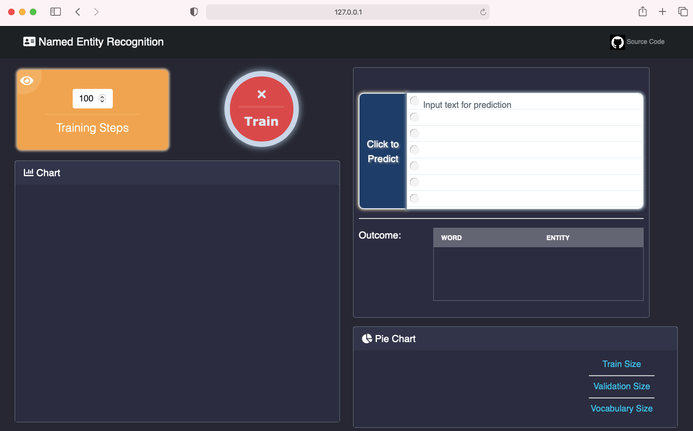
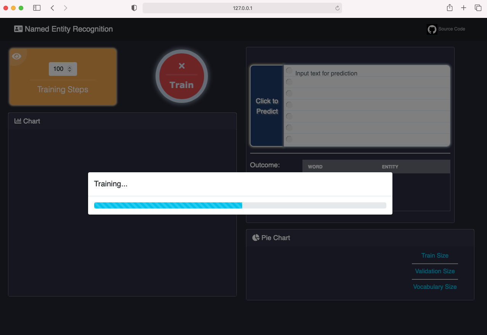
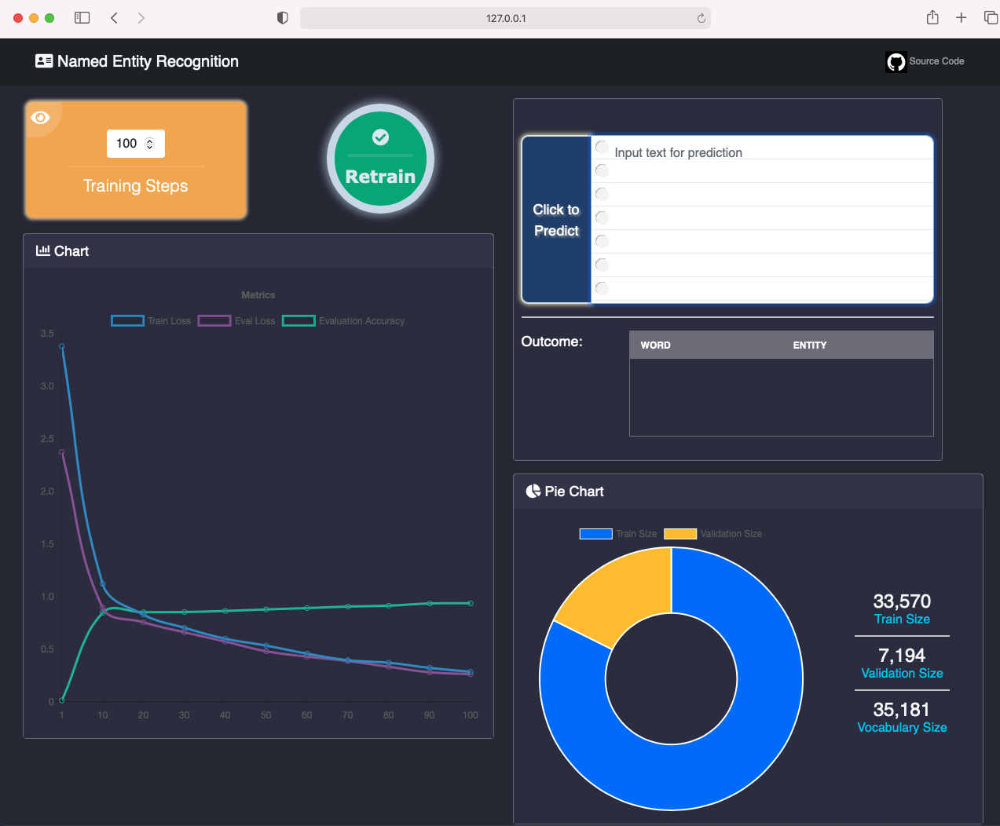
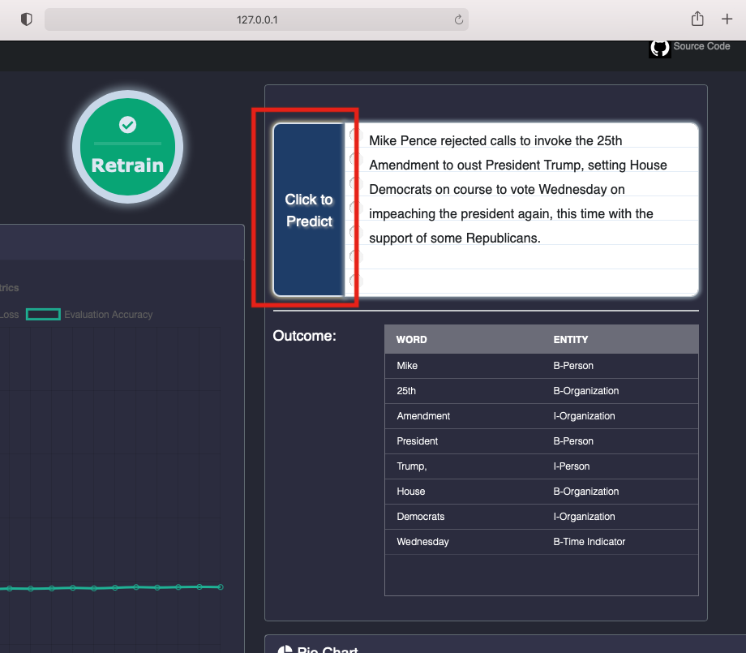

# Named-Entity-Recognition
 
**Named-entity recognition(NER)** is a subtask of information extraction that seeks to locate and classify named entities mentioned in unstructured text into pre-defined categories such as person names, organizations, locations etc.[Wikipedia](https://en.wikipedia.org/wiki/Named-entity_recognition) 

The dataset is used the IOB format (short for inside, outside, beginning)[Wikipedia](https://en.wikipedia.org/wiki/Inside%E2%80%93outside%E2%80%93beginning_(tagging)). It is a common tagging format for tagging tokens in a chunking task in computational linguistics, The `B-` prefix before a tag indicates that the tag is the beginning of a chunk, and an `I-` prefix before a tag indicates that the tag is inside a chunk. The `B-` tag is used only when a tag is followed by a tag of the same type without `O` tokens between them. An `O` tag indicates that a token belongs to no chunk. 

Below tags are used in trainning dataset

Tag | Meaning
--- | --- 
B-geo | B-Geographical Entity 
B-gpe | B-Geopolitical Entity 
B-per | B-Person 
I-geo | I-Geographical Entity 
B-org | B-Organization 
I-org | I-Organization 
B-tim | B-Time Indicator 
B-art | B-Artifact 
I-art | I-Artifact 
I-per | I-Person 
I-gpe | I-Geopolitical Entity 
I-tim | I-Time Indicator 
B-nat | B-Natural Phenomenon 
B-eve | B-Event 
I-eve | I-Event 
I-nat | I-Natural Phenomenon 
O | Filler Word


The model consists of Embedding layer, LSTM layer, Fully-connected layer and LogSoftmax layer.  User can adjust training steps and config LSTM layer number of units to train the model

## Set-up Environment 


```
./run.sh 
```

Above scirpt does the following steps:

- create virtual environment
- activate virtual environment
- download required library 
- start Django server on local computer

Then open a browser, go to [127.0.0.1:8000/](http://127.0.0.1:8000/)

## Train Model 

When load the page at the first time, it shows the model status as untrained. 



To config LSTM layer number of units, simply change `NamedEntityRecognition/LSTMNUnits.txt`

Then can ajdust *training steps* and click *Train button* to train the model. 



After training, charts, traing size, validation size, and vocabulary size will be updated, and button color change to green. 




## Evaluation

After training the model, can input text and click to predict as follow




